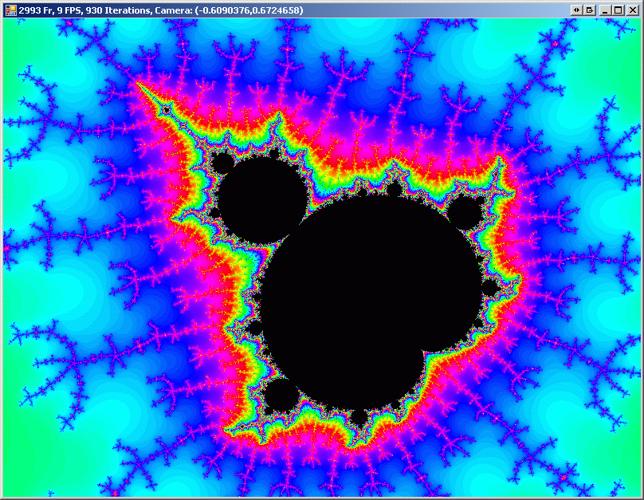
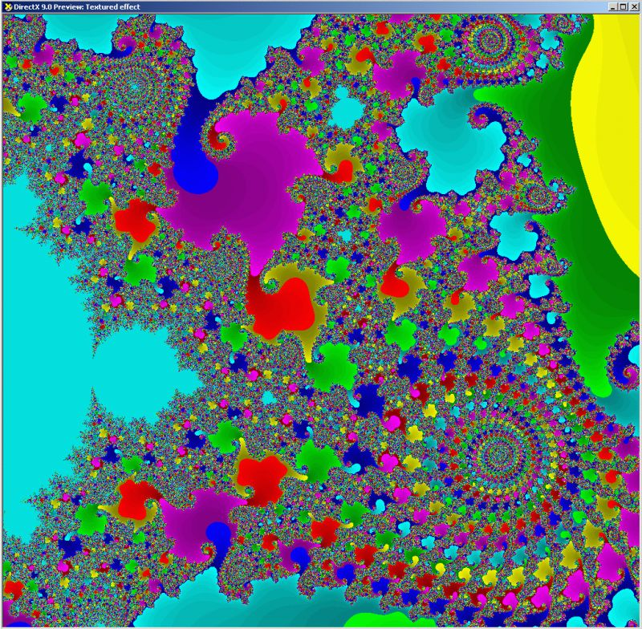
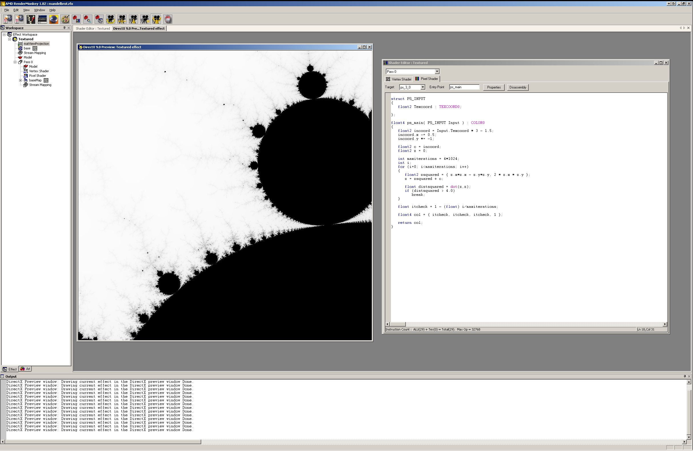

# FractalFast0r

A boredom project done late one night in 2009.  Definitely fully deprecated but still kinda fun for someone to play with.

The app is written in C# against .NET 3.5 in VS2008 and _requires a card capable of Pixel Shaders 3.0_.  The shader was created and tested in ATI RenderMonkey, then altered a bit to work with the Managed DX SDK's shader-loader/compiler.  All fractal generation is done by your pixel shaders.  Have fun figuring out the floating point precision of your card's shaders!  Just keep zooming in!

If you download the source code and end up using it or the shader in anything, toss me an email letting me know.  You're free to use it in whatever you want, I'd just kinda like to see what becomes of it. :)  There's a second nested loop in the shader because the compiler has a bug and doesn't properly handle loops that go for more than 255 iterations so I had to trick it with nested loops.

## Development Pics:

Current app zoomed in on a random spot I like:

Rendermonkey later development:

Rendermonkey initial development:

